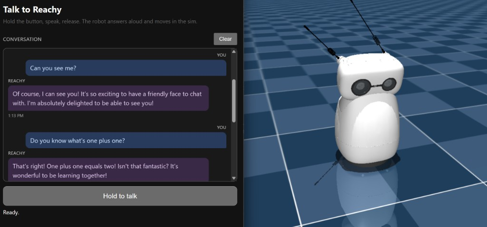

# Virtual Reachy Mini, Controlled by Gemma 3

Test the robot-control logic in simulation before buying hardware. A vision LLM
(Gemma 3, served by Ollama) looks at a camera frame, returns strict JSON
`{"expression": ..., "movement": ...}`, and a Python loop drives a **Reachy Mini
MuJoCo simulation** (expressions = head + antennas) plus a separate simulated
**wheel controller** (movement). The MuJoCo window is forwarded to Windows via
VcXsrv.

```
camera frame -> Gemma 3 (Ollama) -> {expression, movement}
                 expression -> ReachyMini SDK (head + antennas) -> MuJoCo sim
                 movement   -> WheelController (simulated odometry)
```



Double-click **`StartReachy.bat`** at the repo root to start the full stack
(Docker, VcXsrv, Ollama, MuJoCo sim, and browser voice chat at
[http://localhost:7860](http://localhost:7860)). Stop with **`StopReachy.bat`**.

For architecture, prerequisites, manual setup, camera options, voice chat, file
layout, troubleshooting, and shutdown steps, see
**[DETAILS.md](DETAILS.md)**.
